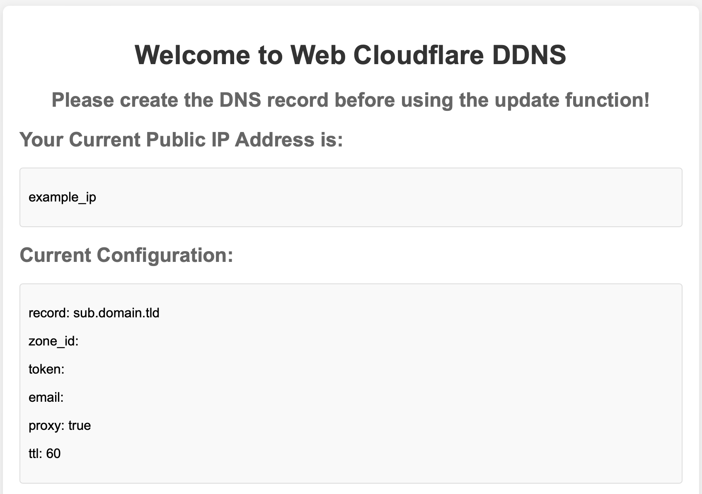
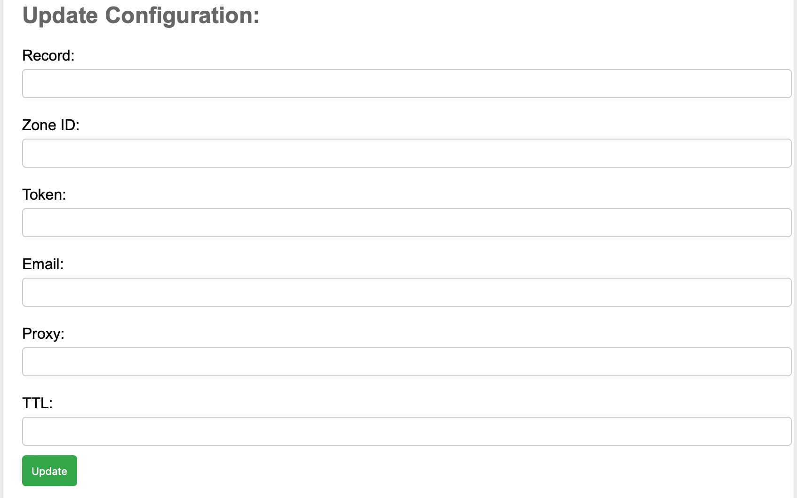
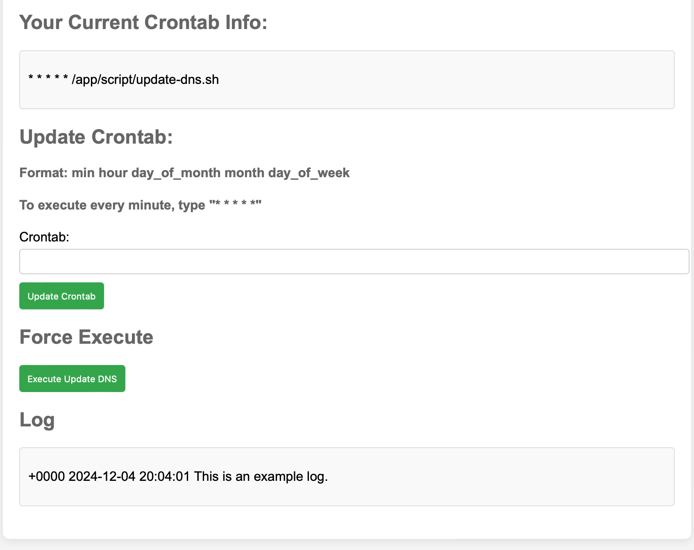

# cloudflare-ddns-webGUI

Configure update Cloudflare DNS A record script easily with webGUI that hosts on a docker image

[台灣繁體中文 請按這](README_zh-tw.md)

## Usage

1. Git clone to your choosen destination

   `git clone https://github.com/SamWang8891/cloudflare-ddns-webGUI.git`
2. run setup.sh

   `bash setup.sh` or `sudo bash setup.sh`
3. Visit the website on http://localhost:8888
4. Have fun!

## Issues / bugs?

For issues and bugs, you are welcomed to post issues and do pull request. Note that please do pull request to modding branch.
