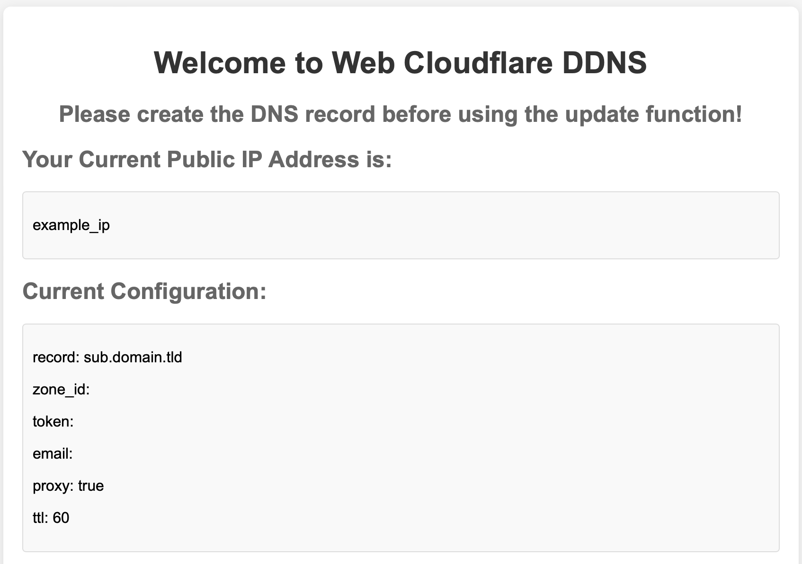
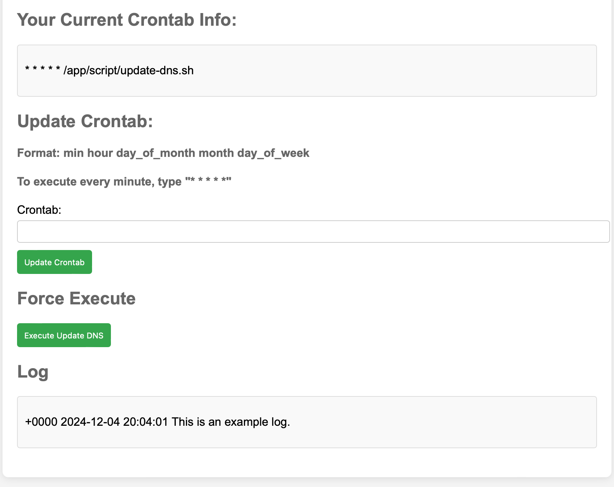

# cloudflare-ddns-webGUI

使用 Docker 並用網頁設定自動更新於 Cloudflare 上的 A 紀錄！

[Link for English version](README.md)

## 使用方法

1. Git clone 到你的偏好位置

   `git clone https://github.com/SamWang8891/cloudflare-ddns-webGUI.git`
2. 執行 setup.sh

   `bash setup.sh` 或 `sudo bash setup.sh`
3. 於瀏覽器中連接 http://localhost:8888
4. 大功告成！

## 問題 / bugs?

歡迎於issue區提出任何問題與 pull request。請注意 pull request 只接受對於 modding branch。
